# 🍅 Pomodoro Elite

  

    <b>Focus, Track, and Achieve.</b> 
    <i>A professional productivity suite designed to master your time management.</i>
  

  
  
    

[Report Bug](https://github.com/HarunMercan1/pomodoro_elite/issues) · [Request Feature](https://github.com/HarunMercan1/pomodoro_elite/issues)

---

## 📱 About the Project

**Pomodoro Elite** is not just a simple timer; it is a comprehensive productivity companion engineered to help users reclaim their focus in a distracted world. Built with **Flutter**, this application leverages the scientifically proven Pomodoro Technique to break work into manageable intervals, separated by short breaks.

The app is designed with a "focus-first" philosophy. It eliminates distractions by providing an immersive environment complete with ambient background sounds (like rain, forest, or white noise) and motivational quotes that refresh with every session. Unlike standard timers, **Pomodoro Elite** emphasizes data-driven progress, offering detailed analytics to visualize your productivity trends over time.

Whether you are a student preparing for exams, a developer coding for hours, or a professional managing tight deadlines, Pomodoro Elite adapts to your workflow with fully customizable duration settings and dynamic theming that visually signals your current state.

## ✨ Key Features

- **🎯 Adaptive Timer System:** Fully customizable timers for Focus sessions, Short Breaks, and Long Breaks. You control the rhythm of your workflow.
- **📊 Comprehensive Analytics:** Visual charts (powered by `fl_chart`) track your daily focus hours, session counts, and weekly consistency to help you build lasting habits.
- **🎨 Dynamic Visual Feedback:** The UI adapts its color palette in real-time based on the timer state (Focus, Break, Paused, Completed), providing subtle visual cues.
- **🎵 Immersive Soundscapes:** Integrated audio player supporting high-quality ambient sounds (Rain, Storm, Ocean, Forest) to drown out noise and deepen concentration.
- **🌍 Localization:** Native support for both English and Turkish languages, automatically detecting or manually setting the preference.
- **🌑 Modern UI/UX:** A sleek, distraction-free interface with full Dark Mode support for late-night sessions.

## 📸 Screenshots (English)

  <table>
    <tr>
      <td align="center"><b>Home Screen</b></td>
      <td align="center"><b>Focus Session</b></td>
      <td align="center"><b>Paused / Break</b></td>
      <td align="center"><b>Session Complete</b></td>
    </tr>
    <tr>
      <td align="center">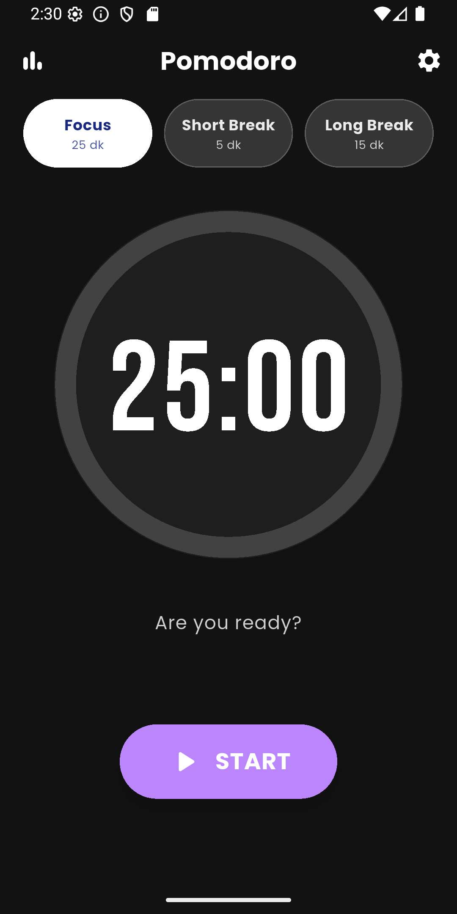</td>
      <td align="center">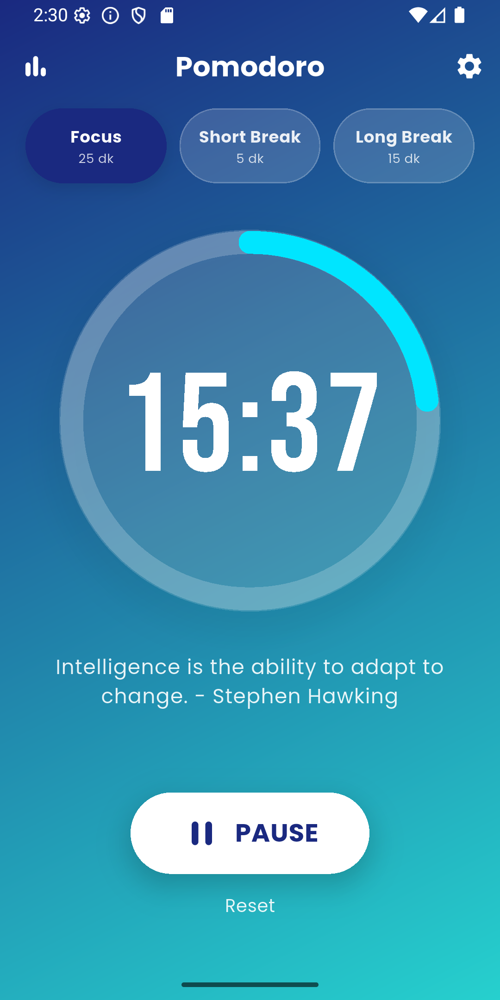</td>
      <td align="center">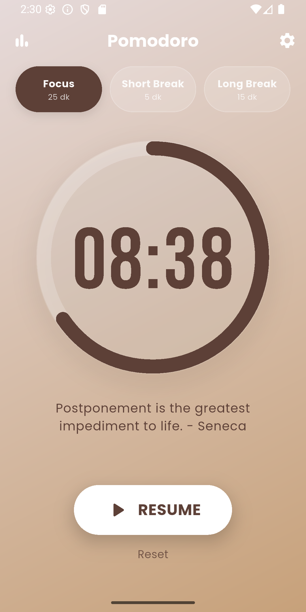</td>
      <td align="center">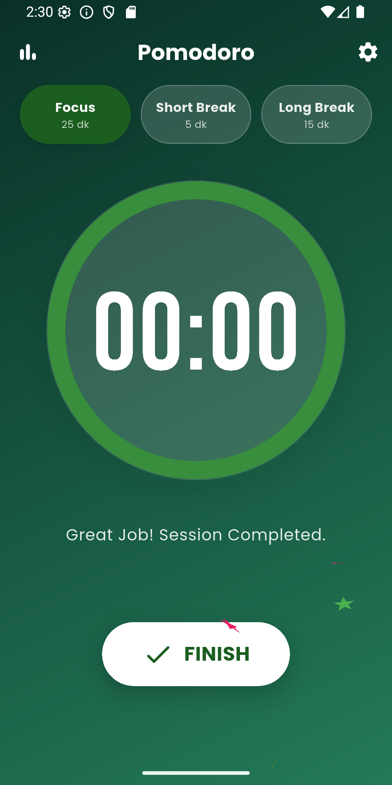</td>
    </tr>
    <tr>
      <td align="center"><b>Statistics</b></td>
      <td align="center"><b>Settings Menu</b></td>
      <td align="center"><b>Duration Config</b></td>
      <td align="center"><b>Sound Selection</b></td>
    </tr>
    <tr>
      <td align="center">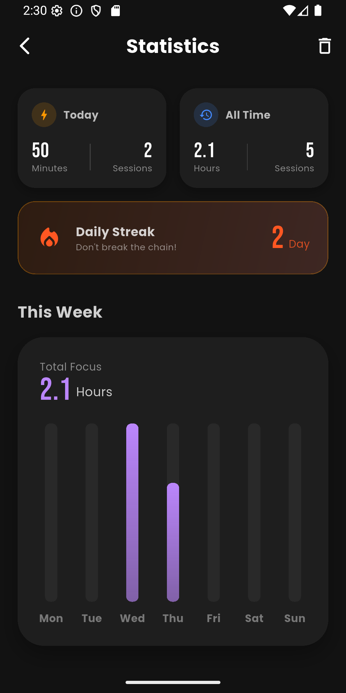</td>
      <td align="center">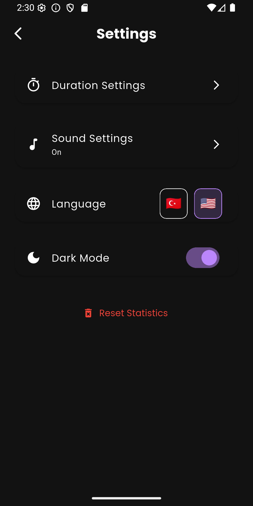</td>
      <td align="center">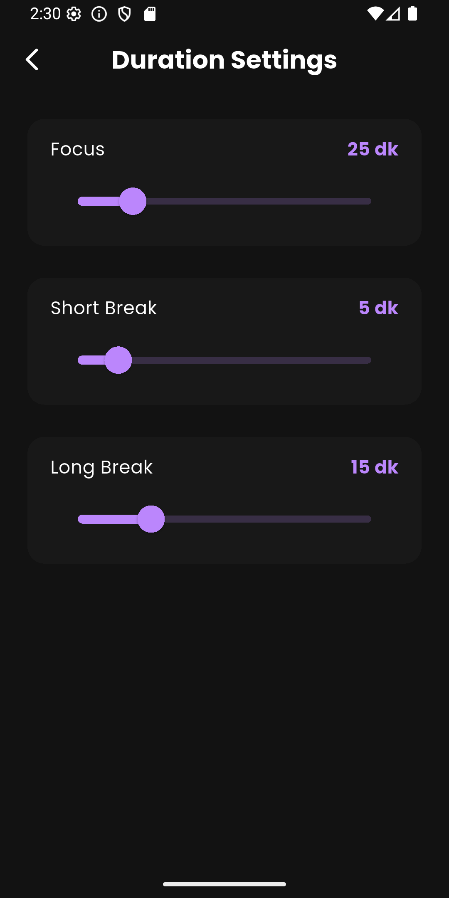</td>
      <td align="center">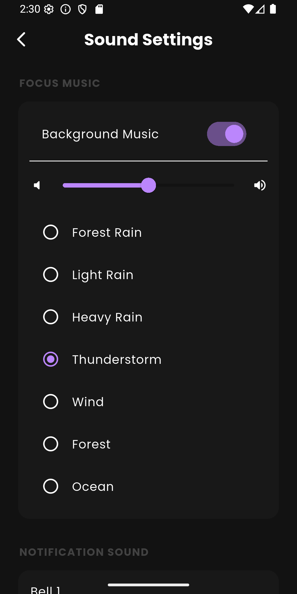</td>
    </tr>
  </table>

## 🛠️ Tech Stack

- **Framework:** Flutter (Dart)
- **State Management:** Provider / Riverpod / Bloc _(Update based on your code)_
- **Local Storage:** Hive / SharedPreferences
- **Charting:** fl_chart
- **Audio Engine:** audioplayers

---

## 🇹🇷 Türkçe Proje Detayları

**Pomodoro Elite**, modern dünyanın dikkat dağıtıcı unsurlarına karşı geliştirilmiş, kullanıcıların zaman yönetimi becerilerini en üst seviyeye çıkarmayı hedefleyen profesyonel bir mobil uygulamadır.

Sıradan bir sayaç uygulamasının ötesine geçen Pomodoro Elite, **Flutter** altyapısı ile geliştirilmiş olup, kullanıcıya sadece zamanı göstermekle kalmaz; aynı zamanda motive eder ve analiz sunar. Uygulama, çalışma (odaklanma) ve mola sürelerini kullanıcının ihtiyaçlarına göre optimize etmesine olanak tanır.

Özellikle sınav dönemindeki öğrenciler, yoğun çalışan yazılımcılar ve serbest zamanlı çalışanlar için tasarlanan bu uygulama; yağmur, orman gibi odak artırıcı arka plan sesleri ve her oturumda değişen motivasyon sözleri ile tam bir "çalışma asistanı" görevi görür. Ayrıca, gelişmiş grafik arayüzü sayesinde günler ve haftalar bazında ne kadar verimli çalıştığınızı somut verilerle önünüze serer.

## ✨ Temel Özellikler

- **🎯 Esnek Zamanlayıcı:** Odaklanma, Kısa Mola ve Uzun Mola sürelerini kendi çalışma disiplininize göre tamamen kişiselleştirebilirsiniz.
- **📊 Detaylı Verimlilik Analizi:** Günlük çalışma sürelerinizi, tamamlanan oturum sayısını ve haftalık performansınızı şık grafiklerle takip edin.
- **🎨 Dinamik Tema Motoru:** Uygulama o anki modunuza (Odaklanma, Mola, Bitiş) göre renk değiştirerek görsel hafızanızı tetikler.
- **🎵 Odaklanma Atmosferi:** Dış sesleri izole etmek için entegre edilmiş yüksek kaliteli ortam sesleri (Fırtına, Yağmur, Okyanus vb.).
- **🌍 Çift Dil Desteği:** Türkçe ve İngilizce dil seçenekleri ile global standartlarda kullanıcı deneyimi.
- **🌑 Karanlık Mod:** Göz yormayan, pil dostu ve estetik karanlık mod desteği.

## 📸 Ekran Görüntüleri (Türkçe)

  <table>
    <tr>
      <td align="center"><b>Ana Ekran</b></td>
      <td align="center"><b>Odaklanma Modu</b></td>
      <td align="center"><b>Duraklat / Mola</b></td>
      <td align="center"><b>Tebrikler</b></td>
    </tr>
    <tr>
      <td align="center">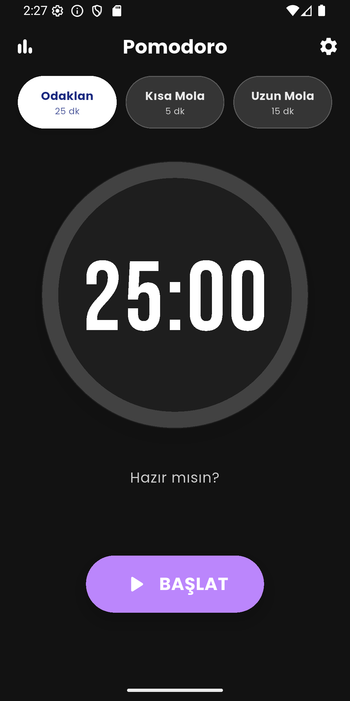</td>
      <td align="center">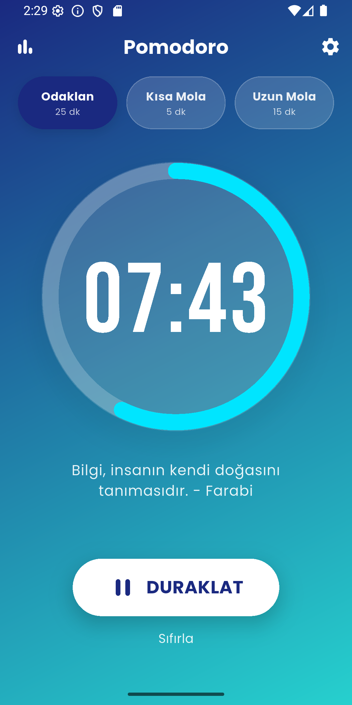</td>
      <td align="center">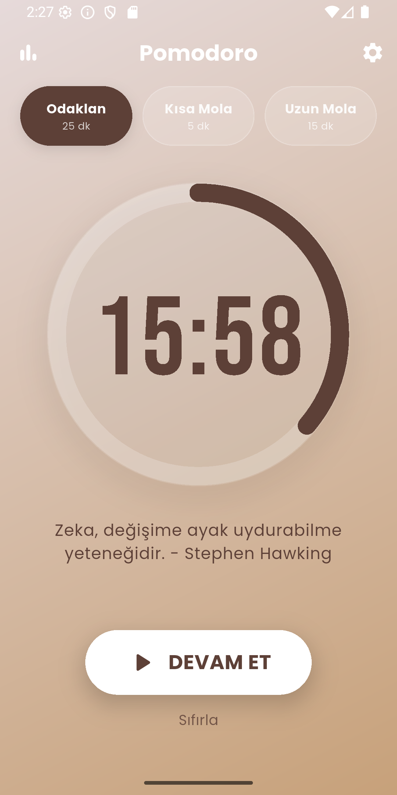</td>
      <td align="center">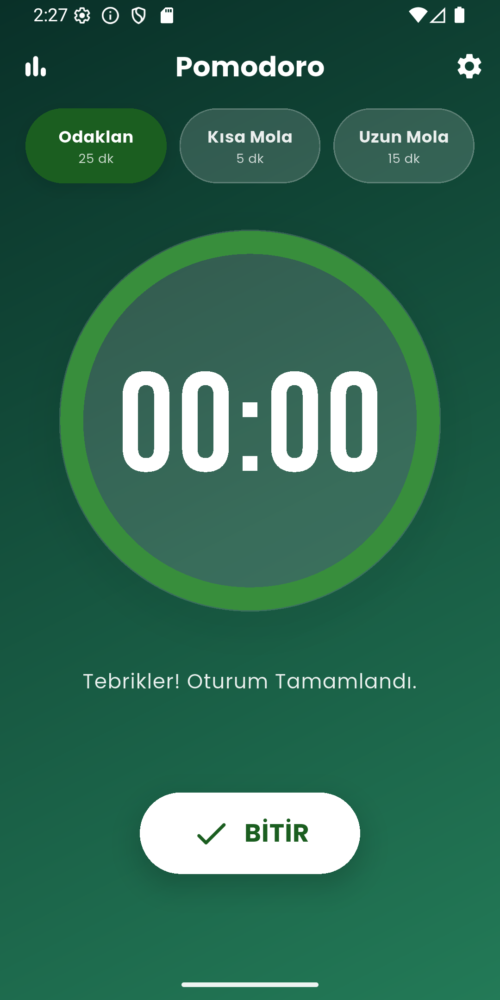</td>
    </tr>
    <tr>
      <td align="center"><b>İstatistikler</b></td>
      <td align="center"><b>Ayarlar</b></td>
      <td align="center"><b>Süre Ayarları</b></td>
      <td align="center"><b>Ses Ayarları</b></td>
    </tr>
    <tr>
      <td align="center"></td>
      <td align="center">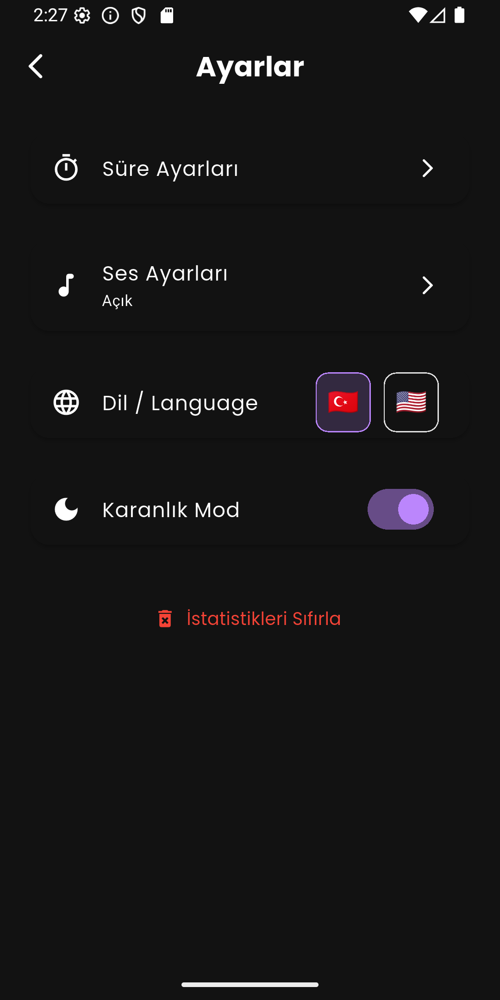</td>
      <td align="center">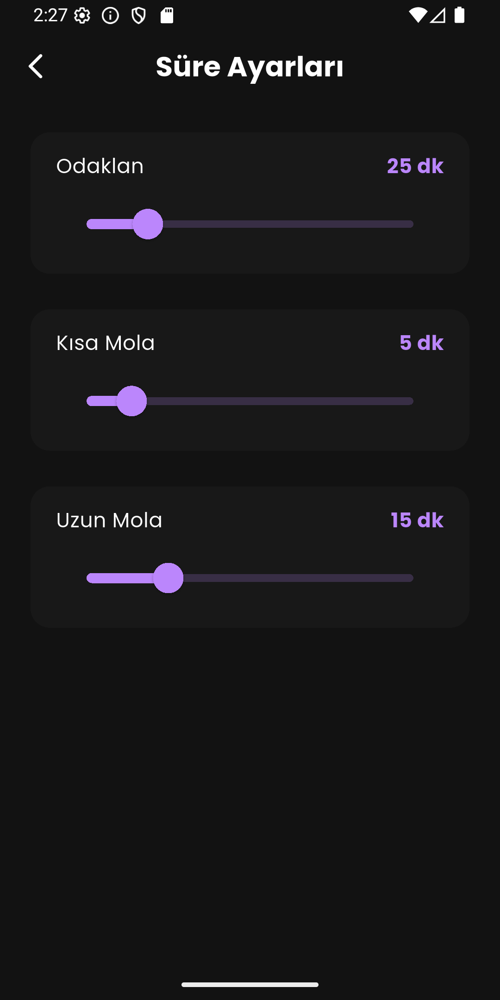</td>
      <td align="center">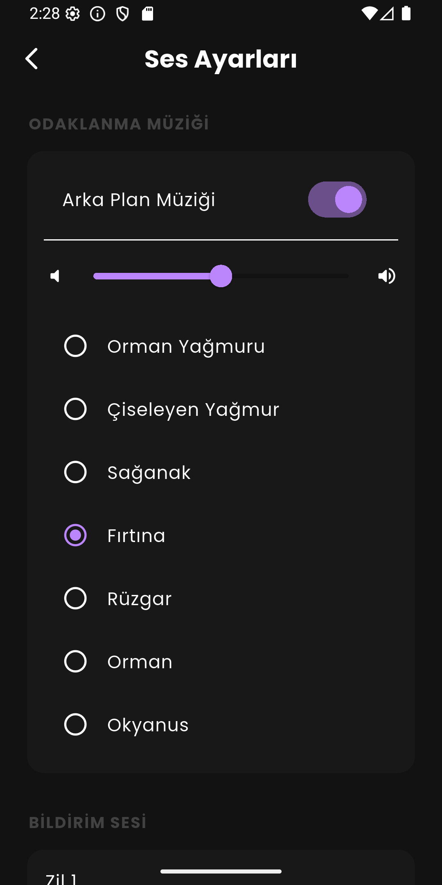</td>
    </tr>
  </table>

## 👤 Yazar / Author

**Harun Reşit Mercan**

- LinkedIn: [Harun Reşit Mercan](https://www.linkedin.com/in/harun-resit-mercan/)
- GitHub: [@HarunMercan1](https://github.com/HarunMercan1)

---

  Built with ❤️ by Harun using Flutter

